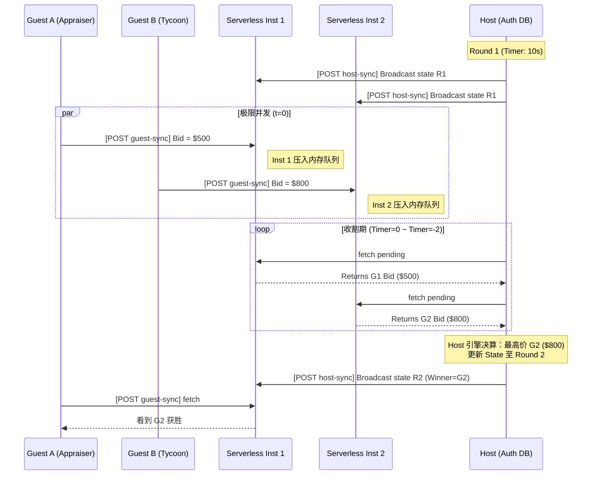

# 竞拍之王 (BidKing) - 分布式架构设计白皮书

> 这是一个基于“极端约束（无DB、无长连接）”下的 Serverless 分布式实时状态同步实验与游戏应用。

## 一、 总体架构思想：Stateless Gossip & Client-as-Host

在 Vercel Serverless（无状态、多副本冷启动）且严格禁止外部数据库和 WebSockets 的极端约束下，实现多人实时游戏，核心破局点在于**转移“状态中心”**。

本系统采用了 **【Client-as-Host（客户端主节点托管）】** 与 **【短轮询 Fleet Gossip（多实例传阅）】** 相结合的架构：
1. **Host 成为真·数据库**：房主（Host）的浏览器 LocalStorage / 内存扮演传统架构中 Redis/MySQL 的角色，掌握绝对状态权限与游戏引擎推进器（状态机）。
2. **Serverless 降层为“信箱缓存”**：Vercel Serverless Function 不持久化任何规则数据，仅在它所运行的单一实例内存中开辟全局 `Map` 作为临时信箱。
3. **多实例数据汇聚（The Gossip）**：Guests 不断将动作（Bid出价）塞入随机请求到的 Vercel 实例；Host 由于高频轮询（800ms），其请求会随着 Vercel 的负载均衡“扫过”多个不同实例，从而像收割机一样把分散在各地实例中的“待处理入队列”收集到客户端进行决算，再将权威最新 State 广播回各个实例，达成最终一致性。

---

## 二、 核心架构图与时序图

### 1. 架构流转图
```mermaid
graph TD
    subgraph Vercel_Serverless_Fleet[Vercel Serverless Fleet - 临时路由]
        InstA[Instance A<br/>RAM Mailbox]
        InstB[Instance B<br/>RAM Mailbox]
        InstC[Instance C<br/>RAM Mailbox]
    end

    Host[🏠 Player 1 (Host)<br/>权威状态中心 JS Engine] -. "1. 高频拉取指令 &<br/>广播全网权威状态" .-> InstA
    Host -. "1. 扫荡式长短轮询" .-> InstB
    Host -. "1. 收割 Bids" .-> InstC

    Guest1[👤 Player 2 (Guest)] -. "2. 拉取权威 State<br/>推送个人 Bid" .-> InstB
    Guest2[👤 Player 3 (Guest)] -. "2. 请求可能落到任意节点" .-> InstC

    Note1[Host 利用高频并发请求“穿透”负载均衡，汇聚全网孤岛数据]
    classDef default fill:#1e293b,stroke:#3b82f6,color:#fff;
    classDef highlight fill:#020617,stroke:#eab308,stroke-width:2px,color:#fff;
    class Host highlight;
```

### 2. 多并发防冲突出价时序图


---

## 三、 状态与并发控制机制

系统摒弃了后端的乐观锁，将**并发冲突的裁决权完全上浮至 Host 客户端**：
- **时序与幂等性**：Serverless 不校验出价是否合法，只无脑追加（Append-Only）。Host 接收到 Bids 凭证后，以 `[GuestID]-[RoundID]` 为复合键。对于同一轮多次提交的出价，Host 只取最后一次最新数据。由于是“暗拍”，玩家之间的加价无因果依赖，彻底消灭了并发冲突（Write-Write Conflict），并发量退化为单机内存合并操作。
- **防止多实例导致的“截断丢包 (Ghost Bid)”**：若进入倒计时 0 秒立刻结算，落在孤岛实例上的 Bid 可能还未来得及被 Host 扫走。因此，游戏引擎设计了 **3秒缓冲锁定等待（Locking Buffer）机制**：倒计时归0后，UI 显示“正在封标”，Host 继续轮询 3 秒以“榨干”所有 Vercel 活跃实例上的残留队列，随后才执行决算。

---

## 四、 API 接口契约与安全性设计

采用无状态自签名（Stateless JWT-like）防篡改。所有鉴权密钥挂载于 Serverless 环境变量（或默认常量），即便实例销毁也能在冷启动后立刻复原子签名验证体系。

| 接口路线 | Action (Body) | Authorization (Header) | 功能 | Response / Error |
| :--- | :--- | :--- | :--- | :--- |
| `POST /api/relay` | `action: 'create'` | (None) | Host 创建房间 | 返回 `roomId` 和 `hostToken` (含 HMAC 签名) |
| `POST /api/relay` | `action: 'join'` | (None) | Guest 加入房间 | 返回 `guestId`, `guestToken` (包含玩家身份防篡改) |
| `POST /api/relay` | `action: 'host-sync'` | `Bearer <hostToken>` | Host 强推游戏主状态，并拉取队列 | 返回 `{ pendingBids, pendingJoins }`。401 若篡改 Token |
| `POST /api/relay` | `action: 'guest-sync'`| `Bearer <guestToken>` | Guest 拉取全局状态，推送操作 | 返回 `{ state }`。401 若篡改 Token |

---

## 五、 轮询与实时性优化策略

1. **动态退避心跳 (Dynamic Backoff)**：非激烈博弈期（Lobby阶段、结算展示期）轮询频率降至 `2000ms`，一旦进入激烈的 Bidding 读秒期，频率骤升至 `500ms`，既保证低于人类感知的心流延迟，又不至于快速耗尽 Vercel 免费调用配额（100,000次/天）。
2. **轻量增量载荷**：在 Bidding 期间，由于不需要公布其他玩家的具体出价（暗标法则），推流的 `state` 将屏蔽真实底标，只维护版本号 `roundID` 与 `timer`，使 JSON 体积紧凑于 1KB 以内。

---

## 六、 灾备、容错与生命周期

- **Serverless 实例重启（冷启动）**：无任何影响。由于内存只有排队中的微小队列（存活寿命不超过800ms），一旦新实例拉起，Host 下一次推送立刻为其填充完整的房间上下文状态地图（Auto-healing Room State）。
- **房主 (Host) 掉线 / 刷新页面**：Host 的浏览器每次状态机转移都在 `localStorage.setItem('bidking_host_state', ...)` 存盘。一旦 Host 意外刷新，React 组件挂载时立刻接管先前的 Token 和持久化状态机，完美无缝重连，甚至不打断当面剩余的 5 秒竞拍倒计时。
- **房间幽灵销毁 (Garbage Collection)**：没有 DB 就不需要 CRON。任意 Serverless 实例内存中的临时 Room 会在 `Date.now() - lastActive > 300000ms`（5分钟无人心跳）后自动从 Map 中清除，完全基于 LRU-like 定时老化机制消融。

---

## 七、 架构师的诚实：系统命门与理论极限分析

站在顶层架构视角，这套强行将无状态平台拧成实时服务的把戏虽精妙，但面对复杂现实存在不可抹杀的缺陷（CAP 取舍中的极端弱 C）：

1. **信任灾难（防君子不防小人）**
   - **痛点**：由于 Host（真实客户端）是完整的校验机与数据库，恶意玩家如果担任 Host 且擅长逆向 JS，可通过篡改 `localStorage` 直接让自己获胜或偷窥底牌。
   - **定性**：局域网派对游戏尚可，若带任何金融价值则为巨大灾难漏洞（需转为 WebRTC P2P + Zero-Knowledge Proofs 解决）。
2. **极端并发下的 “多副本断裂 (Fleet Fragmentation)”**
   - **痛点**：假设瞬时涌入 >30 名玩家，触发 Vercel 并发扩容衍生出数十个实例。由于 Host 的单线程轮询（800ms一次）在这个 3 秒的锁定期内，无法数学上保证“撞见”所有的新生实例，会导致部分可怜的 Guest 出价落到了未被 Host 扫过的实例上。
   - **定性**：玩家越多，丢包率（幽灵出价）随实例分裂指数级升高。本架构安全容量上限在 **5 - 8 人**。
3. **不可抗拒的脏数据（Dirty Read Window）**
   - **痛点**：Host 更新了 Round 2，但 Guest A 的下一次轮询由于 CDN 缓存或落到滞后实例，依然读到 Round 1 的最后几秒。
   - **弥补**：通过在 Client 端引入**状态单调递增逻辑 (Monotonic Versioning)**，若拉取到的 `roundId` < 当前缓存，直接抛弃旧数据，用前端表现掩盖一致性断层。
# BK
